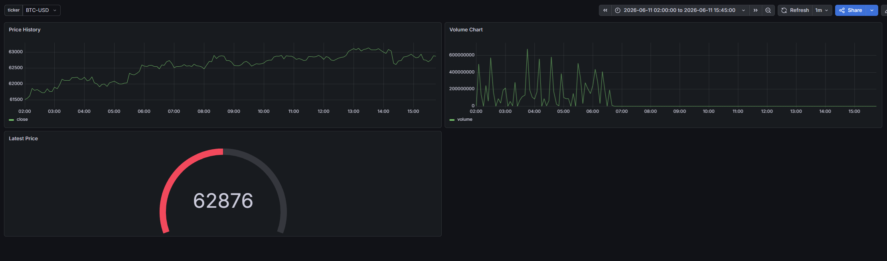
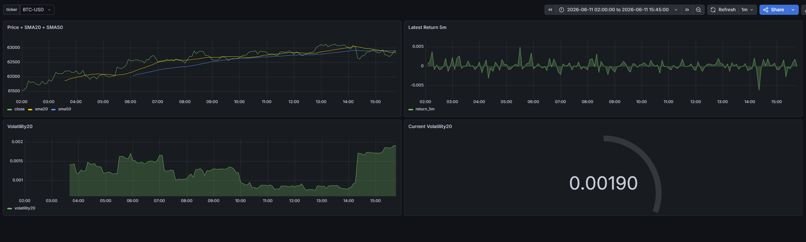
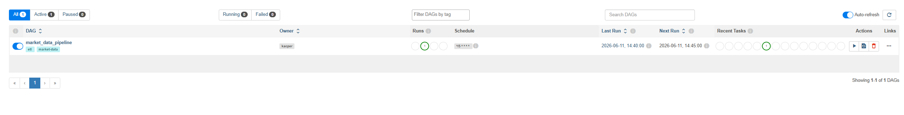

# Financial Market Data Pipeline

## Overview
This project implements an end-to-end market data pipeline. Market prices are extracted from Yahoo Finance, validated and transformed using Pandas, and stored in PostgreSQL. The pipeline creates both Bronze and Silver data layers and is orchestrated by Apache Airflow. Grafana dashboards provide real-time visualization of market metrics and technical indicators
## Architecture
```text
Yahoo Finance
      ↓
   Extract
      ↓
 Transform
      ↓
Bronze Layer (PostgreSQL)
      ↓
Silver Layer
      ↓
Grafana Dashboards

Airflow
      ↓
Triggers ETL every 5 minutes
```
## Technologies
- Python
- Pandas
- SQLAlchemy
- PostgreSQL
- Grafana
- Apache Airflow
- Docker Compose

## Features
- Automated market data extraction from Yahoo Finance
- Data validation and cleaning
- Duplicate handling with PostgreSQL upserts
- Bronze and Silver data layers
- Technical indicators (SMA20, SMA50, returns, volatility)
- Automated Grafana dashboard provisioning
- Automated datasource provisioning
- Airflow orchestration every 5 minutes
- Fully containerized with Docker Compose

## Project Structure
app/
├── etl/
│   ├── extract.py
│   ├── transform.py
│   └── load.py
├── config.py
└── main.py

airflow/
grafana/
sql/

## Setup
```bash
git clone https://github.com/<username>/financial-market-data-pipeline.git

cd financial-market-data-pipeline

docker compose up -d --build
```

## Running the Project
### Grafana

http://localhost:3000

### Airflow

http://localhost:8080

Default credentials:

- Username: admin
- Password: admin

## Grafana Dashboards

The project includes interactive Grafana dashboards connected directly to PostgreSQL.

Key features:
- Real-time market price visualization
- Trading volume monitoring
- Multi-asset comparison (stocks and cryptocurrencies)
- Dynamic ticker selection using Grafana variables
- Historical price analysis and trend monitoring

### Market Overview



### Asset Comparison



---

## Apache Airflow Orchestration

Data ingestion and processing are orchestrated using Apache Airflow.

The ETL workflow consists of:

1. **Extract** – Download market data from Yahoo Finance.
2. **Transform** – Normalize, validate and clean market data.
3. **Load** – Store validated records in PostgreSQL while preventing duplicates.

The DAG is scheduled to run automatically every 5 minutes and includes logging, retry mechanisms and monitoring capabilities.



## Future Improvements

- Gold Layer
- Additional technical indicators
- Cloud deployment
- Real-time streaming with Kafka